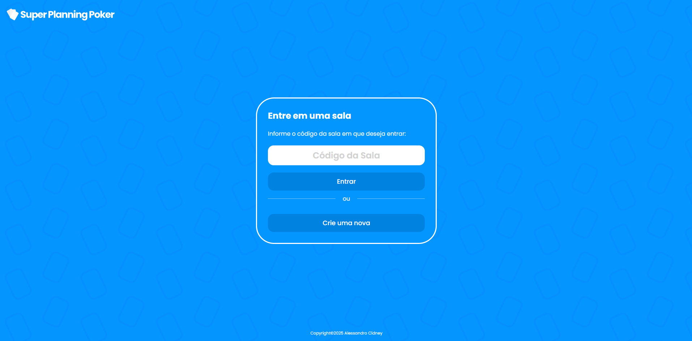
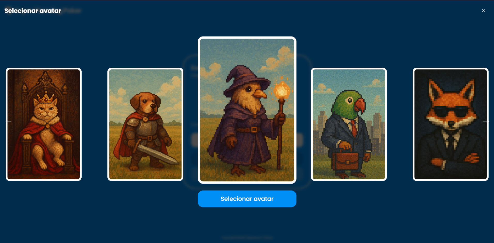
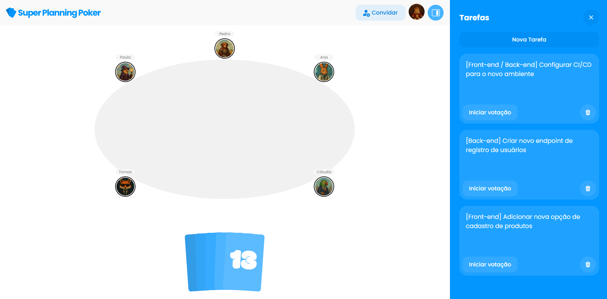
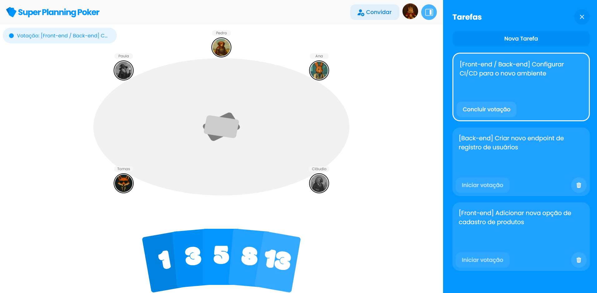

# Super Planning Poker
Super Planning Poker is a web application built with React, Vite, Node.js, Socket.IO, and Express. It can be used to estimate User Story points during Planning meetings, for example. The app provides a real-time voting system, story management features, and live communication between user groups using WebSocket to create virtual rooms.


## Live Website
You can access the website at <https://superplanningpoker.web.app>

## How to Run the Website Locally

### Package Installation
Make sure to install the dependencies using **yarn** or an equivalent package manager.

> Note: This project was created with yarn and includes yarn.lock files. <br />
> If you prefer to use a different package manager, remove all yarn.lock files before running the install command.

To install the dependencies using yarn, navigate to the frontend and backend folders and run the command in each one.
```
yarn install
```

### Environment Variables
After that, create a **.env** file in both the frontend and backend directories, and configure the environment variables based on each folder’s **.env.example** file.

### Run on Localhost
Finally, to run the project at <http://localhost:3000> (frontend) and <http://localhost:8080> (backend), use the following command in both the frontend and backend folders:
```
yarn dev
```

## Screenshots
Below you can check out screenshots of the platform’s main features.

### Initial Screen


### Name Selection Screen


### Avatar Selection Screen


### Room Screen


### Voting Screen

